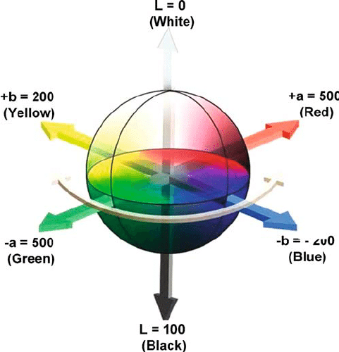
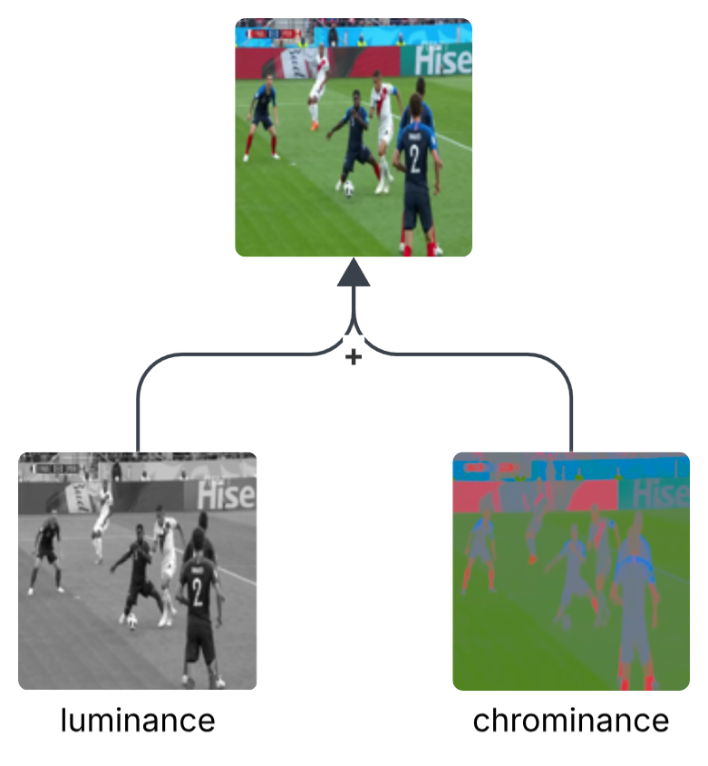
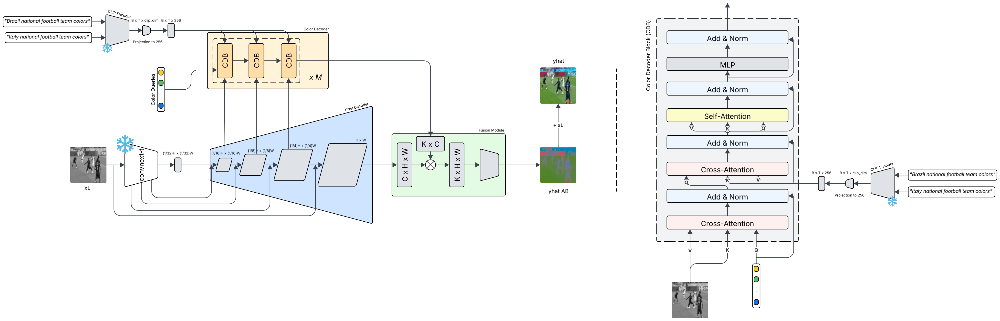

## WC-DDColor

This directory wraps the added Football World Cup coloring logic. This process follows *universal* deep learning flow, with a clear goal, coloring old black and white Football World Cup images.

add universal flow image

## 0.- State of the Art

First, to gain an overview of the current literature on the colorization of old black-and-white images, a minimal state-of-the-art review was conducted. This was necessary to determine the most suitable approach for the World Cup-specific use case, while keeping the resource–complexity trade-off low, preferably within the limits of available free compute tiers or around $50 in cloud provider credits.

Recent image colorization research has shifted from direct color prediction toward models that use stronger semantic, generative, and controllable priors.

**GAN-based and generative-prior methods.**
Recent GAN-era approaches focused on improving realism, saturation, and diversity. ChromaGAN used adversarial and semantic losses to produce more vivid colors, while InstColorization introduced instance-level reasoning through object detection and fusion modules. GCP-Colorization further advanced this direction by using pretrained GAN features as generative color priors for more coherent and realistic results.

- Vitoria, P., Raad, L., & Ballester, C. (2020). ChromaGAN: Adversarial picture colorization with semantic class distribution. Proceedings of the IEEE/CVF Winter Conference on Applications of Computer Vision.
- Weng, S., Sun, J., Li, Y., Li, S., & Shi, B. (2022). CT2: Colorization transformer via color tokens. European Conference on Computer Vision.
- Wu, Y., Wang, X., Li, Y., Zhang, H., Zhao, X., & Shan, Y. (2021). Towards vivid and diverse image colorization with generative color prior. Proceedings of the IEEE/CVF International Conference on Computer Vision.

**Transformer-based methods.**
Transformer models improved colorization by capturing long-range semantic relationships. ColTran used a transformer-only pipeline for probabilistic color generation, CT2 represented colorization through learned color tokens, and ColorFormer introduced a color-memory mechanism to retrieve semantic-color priors. These works moved the field from local per-pixel prediction toward structured semantic color reasoning.

- Kumar, M., Weissenborn, D., & Kalchbrenner, N. (2021). Colorization transformer. International Conference on Learning Representations.
- Saharia, C., Chan, W., Chang, H., Lee, C. A., Ho, J., Salimans, T., Fleet, D. J., & Norouzi, M. (2022). Palette: Image-to-image diffusion models. ACM SIGGRAPH.
- Su, J.-W., Chu, H.-K., & Huang, J.-B. (2020). Instance-aware image colorization. Proceedings of the IEEE/CVF Conference on Computer Vision and Pattern Recognition.

**Hybrid and diffusion-assisted methods.**
The most recent works combine multiple priors and stronger generative models. Palette showed that conditional diffusion models can be used as a general image-to-image framework for colorization. DDColor achieved strong results with a dual-decoder architecture, where a pixel decoder restores spatial detail and a query-based color decoder assigns semantic colors. CVPR 2024’s Automatic Controllable Colorization via Imagination pushed the field toward controllable pipelines by combining latent diffusion, ControlNet-style conditioning, DINOv2-based segment matching, and transformer-based colorization.

- Ji, X., Jiang, B., Luo, D., Tao, G., Chu, W., Xie, Z., Wang, C., & Tai, Y. (2022). ColorFormer: Image colorization via color memory assisted hybrid-attention transformer. European Conference on Computer Vision.
- Kang, X., Yang, T., Ouyang, W., Ren, P., Li, L., & Xie, X. (2023). DDColor: Towards photo-realistic image colorization via dual decoders. Proceedings of the IEEE/CVF International Conference on Computer Vision.
- Cong, X., Wu, Y., Chen, Q., & Lei, C. (2024). Automatic controllable colorization via imagination. Proceedings of the IEEE/CVF Conference on Computer Vision and Pattern Recognition.


**Approach selection.**
DDColor was selected as the project target because it offers a strong pretrained colorization baseline, a clear `L -> AB` Lab prediction formulation, and a lighter fine-tuning path than diffusion-based controllable systems. Its dual-decoder design also leaves a natural extension point for adding World Cup-specific context, such as team metadata, without replacing the original visual colorization pipeline.

## 1.- Defining the Problem

As stated at the beginning of this doc, the goal is to color old black and white football images, but what does coloring mean really? 

There are multiple ways in which coloring can be performed, for this work the previously mentioned DDColor has been selected as target architecture. Therefore, the target problem definition has been adopted, that is **prediciting the chrominance (`AB`) of the images receiving the luminance (`L`) as input** — following the CIELAB color space.

<p align="center">
  
</p>

In order to visualize how the luminance and chrominance dimensions of an image look the following example might be useful.

<p align="center">
  
</p>

Also, image metadata may be allowed as an additional contextual input, e.g. team names in the image.

## 2.- Choosing a Measure of Success

### 2.1.- Losses
Once the target problem has been defined in detail — predicting the chrominance receiving the luminance as input — it's crucial to determine which is the measure of success the model must follow during training, in other words the *loss*.

Once more, taking the DDColor work as a base, these are some of the losses that can be used to guide the training process:

**Pixel Loss**

The pixel loss $L_{\text{pix}}$ is the L1 distance between the colorized image $\hat{y}$ and the ground-truth image $y$. It provides pixel-level supervision and encourages the generator to produce outputs similar to the real image.

**Perceptual Loss**

The perceptual loss $L_{\text{per}}$ is used to make the generated image $\hat{y}$ semantically consistent with the real image $y$. It minimizes the semantic difference between both images using features extracted from a pretrained VGG16 network.

**Adversarial Loss**

The adversarial loss $L_{\text{adv}}$ is computed using a PatchGAN discriminator, which learns to distinguish between generated and real images. This encourages the generator to produce more realistic and visually convincing results.

**Colorfulness Loss**

The colorfulness loss $L_{\text{col}}$ encourages the model to generate more colorful and visually pleasing images. It is inspired by the colorfulness score and is defined as:

$$L_{\text{col}} = 1 - \frac{\sigma_{\text{rgyb}}(\hat{y}) + 0.3 \cdot \mu_{\text{rgyb}}(\hat{y})}{100}$$

where:

* $\sigma_{\text{rgyb}}(\cdot)$ is the standard deviation of the pixel cloud in the color plane.
* $\mu_{\text{rgyb}}(\cdot)$ is the mean value of the pixel cloud in the color plane.

**Full Generator Objective**

The complete generator loss is defined as:

$$L_{\theta} = \lambda_{\text{pix}} L_{\text{pix}} + \lambda_{\text{per}} L_{\text{per}} + \lambda_{\text{adv}} L_{\text{adv}} + \lambda_{\text{col}} L_{\text{col}}$$

where $\lambda_{\text{pix}}$, $\lambda_{\text{per}}$, $\lambda_{\text{adv}}$, and $\lambda_{\text{col}}$ are balancing weights for the different loss terms.

---

**Smoothness Penalty**

Additionally, for simpler experiments the smoothness loss has been defined. This penalty discourages high-frequency checkerboard chroma:

$$
\mathcal{L}_{tv} = \lvert \nabla_x \hat{y}_{AB} \rvert + \lvert \nabla_y \hat{y}_{AB} \rvert
$$

**Baseline Generator Objective**

This last loss can be combined with the previously explained pixel and colorfulness loss to obtain a baseline fast loss:

$$
\mathcal{L}_{\theta} = \lambda_{pix}\mathcal{L}_{pix} + \lambda_{tv}\mathcal{L}_{tv} + \lambda_{col}\mathcal{L}_{col}
$$

### 2.2.- Metrics

In addition to the training losses, several metrics are used to evaluate the generated colorizations. These metrics are not all used as optimization objectives; instead, they provide complementary views of the model's behavior on validation and test images.

**AB Mean Absolute Error**

The AB mean absolute error measures the average absolute difference between the predicted chrominance channels $\hat{y}_{AB}$ and the ground-truth chrominance channels $y_{AB}$:

$$
\text{MAE}_{AB} = \frac{1}{N} \sum_i \left| \hat{y}_{AB}^{(i)} - y_{AB}^{(i)} \right|
$$

This metric is useful for the first autoencoder experiments because it directly evaluates the target prediction space. Lower values indicate that the predicted chrominance is closer to the ground truth at the pixel level.

**DeltaE AB**

The approximate DeltaE AB metric measures the Euclidean distance between predicted and real chrominance values:

$$
\Delta E_{AB} = \sqrt{(\hat{a} - a)^2 + (\hat{b} - b)^2}
$$

This gives a more color-space-oriented error measure than plain MAE. It is still computed only over the chrominance channels, so it focuses on color prediction rather than luminance reconstruction.

**Peak Signal-to-Noise Ratio**

Peak signal-to-noise ratio (PSNR) is computed between the predicted RGB image and the ground-truth RGB image:

$$
\text{PSNR} = -10 \log_{10}(\text{MSE})
$$

Higher PSNR indicates lower pixel-level reconstruction error in RGB space. It is useful as a general fidelity metric, although it does not always correlate with perceptual realism in ambiguous colorization tasks.

**Structural Similarity**

Structural similarity (SSIM) compares the predicted and ground-truth RGB images using local luminance, contrast, and structure statistics. It is used to measure whether the generated image preserves image structure and visual consistency.

Higher SSIM values indicate that the prediction is structurally closer to the ground-truth image. In the team-conditioned DDColor experiments, validation SSIM is used to select the best checkpoint.

**Colorfulness Score**

The colorfulness score measures how vivid the predicted RGB image is. It follows the same red-green and yellow-blue opponent color statistics used by the colorfulness loss:

$$
\text{CF}(\hat{y}) = \sigma_{\text{rgyb}}(\hat{y}) + 0.3 \cdot \mu_{\text{rgyb}}(\hat{y})
$$

This metric is useful because colorization models can obtain reasonable reconstruction scores while producing desaturated outputs. The colorfulness score helps detect whether the model is actually generating visually meaningful chroma.

**Final Evaluation Set**

For the simple autoencoder, the main reported metrics are `AB MAE`, `DeltaE AB`, and `PSNR`. For the DDColor and team-conditioned DDColor experiments, the main validation and test metrics are `PSNR`, `SSIM`, and `colorfulness`.

## 3.- Select the Evaluation Protocol

As available computing time is limited — around 50-100$ cloud provider credits — a simple but yet effective validation protocol has been selected, the traditional **train test split**. Focusing on the training, the adopted split ratios are:

- 80% train
- 10% validation
- 10% test

## 4.- Preparing the Data

The dataset is prepared from image files and, for the team-conditioned experiments, a CSV metadata file containing the image path and the two teams playing the match. The expected metadata structure is:

```text
path,team1,team2
```

The `path` column is resolved relative to the configured image root. Rows without both team names are ignored in the team-conditioned setup, since that architecture requires exactly two teams per image.

**Image Processing**

The image preprocessing pipeline follows the colorization problem definition: keep luminance as input and predict chrominance as target.

1. Load the image.
2. Convert it to `RGB`.
3. Resize it to the selected square training resolution. The simple autoencoder uses `128 x 128`; the DDColor experiments use the configured DDColor input size, usually `256 x 256`.
4. Apply random horizontal flip only during training.
5. Convert the image from `RGB` to `CIELAB`.
6. Split the image into luminance and chrominance:

```text
L  -> model input information
AB -> target color channels
```

For the simple autoencoder notebook, the channels are normalized before training:

```text
L  -> L / 50 - 1
AB -> AB / 128
```

For the DDColor notebooks, the tensors keep the DDColor training contract:

```text
L:  [1, H, W]
AB: [2, H, W]
```

Before being passed to DDColor, the `L` channel is converted back into a 3-channel grayscale RGB-like tensor. This keeps compatibility with the original DDColor encoder, which expects a 3-channel image input, while the supervision is still performed over the predicted `AB` channels.

**Text Processing**

Text processing is only used in the team-conditioned DDColor model. The two team names are transformed into CLIP prompts using the template:

```text
"{} national football team colors"
```

For example:

```text
"Brazil national football team colors"
"Germany national football team colors"
```

These prompts are encoded with a frozen CLIP text encoder and projected to the internal color decoder dimension. Therefore, each team-conditioned training sample provides:

```text
L image tensor
AB target tensor
team1 name
team2 name
```

This keeps the visual task unchanged — predict chrominance from luminance — while adding team identity as global semantic color context.

## 5.- Developing a 1st Model

Before adapting DDColor, a first simple model was developed in `simple_ae_world_cup.ipynb`. The goal of this experiment was not to obtain the best possible colorization quality, but to validate the complete learning pipeline with a lightweight architecture: data loading, Lab conversion, train/validation/test split, losses, checkpointing, and visual inspection of predictions.

The selected baseline is a convolutional autoencoder that receives only the normalized `L` channel and predicts the normalized `AB` channels. Its structure is intentionally minimal:

```text
L input
  -> convolution + downsampling blocks
  -> compact latent feature representation
  -> bilinear upsampling + convolution blocks
  -> tanh output for AB prediction
```

The model uses three downsampling convolution stages, followed by three upsampling stages. Batch normalization and ReLU activations are used in the intermediate layers, and the final `tanh` constrains the predicted `AB` channels to the normalized target range.

The training setup is also kept small:

```text
image size: 128 x 128
batch size: 32
epochs: 5
optimizer: Adam, lr=2e-4
```

The objective combines three terms from the previously defined baseline loss:

```text
pixel L1 loss      -> match the target AB channels
total variation    -> reduce noisy high-frequency chroma
colorfulness loss  -> discourage fully desaturated predictions
```

During validation, the model is evaluated with objective loss, `AB` MAE, approximate `DeltaE` over the chrominance channels, and RGB PSNR. The notebook also plots the training history and compares grayscale input, predicted colorization, and ground-truth color images.

This first model provides a useful sanity check: if the simple autoencoder cannot learn the basic `L -> AB` mapping or the data pipeline produces wrong colors, then scaling to DDColor would only hide the problem behind a larger architecture. Once this baseline is working, the project can move to pretrained DDColor fine-tuning and later to team-conditioned CLIP embeddings.

## 6.- Scaling Up

After validating the complete pipeline with the simple autoencoder, the project scales to DDColor. This step is implemented in `ddcolor_world_cup_team_finetune.ipynb`, but it is useful to separate two ideas clearly: the original DDColor architecture and the proposed team-conditioned extension.

**Original DDColor**


The original DDColor model receives a grayscale image represented as a 3-channel RGB-like input and predicts the `AB` chrominance channels. Its strength comes from using two complementary decoders:

```text
Pixel decoder -> preserves spatial detail and image structure
Color decoder -> reasons with semantic color queries
```

The pixel decoder keeps local structure such as faces, shirts, grass, crowds, and object boundaries. The color decoder uses learned color queries to reason at a more semantic level and assign plausible colors to image regions. In this original setup, all color decisions are inferred from the image content alone.

For the World Cup problem, this is powerful but incomplete. A grayscale shirt may contain enough shape and texture information to identify that it is a football kit, but not always enough information to know whether that kit should be red, yellow, blue, white, green, or another historically plausible team color.

**Proposed Team-Conditioned Architecture**



The proposed architecture keeps the original DDColor visual path and adds a separate text-conditioning path for the two teams in the match. The image still determines where colors should be placed; the team metadata provides global semantic context about which colors are plausible.

Each team name is inserted into the prompt template:

```text
"{} national football team colors"
```

The prompts are encoded with a frozen CLIP text encoder. The resulting embeddings are projected to the DDColor color decoder hidden dimension and injected into the color decoder through an additional cross-attention block. Conceptually, the scaled model receives:

```text
L image input -> where objects and regions are
team prompts  -> which team colors are plausible
```

Therefore, the proposed model does not replace DDColor's visual reasoning. Instead, it augments the color decoder with team-level semantic priors. This is especially useful when multiple colors are visually plausible from luminance alone.

**Pretrained Initialization**

The model starts from the Hugging Face DDColor tiny checkpoint:

```text
piddnad/ddcolor_paper_tiny
```

Those weights are copied into `WorldCupDDColor` with `strict=False`. This is necessary because the proposed architecture has extra modules that do not exist in the original checkpoint:

```text
team projection MLP
team cross-attention layers
CLIP text-conditioning path
```

The unchanged DDColor layers reuse pretrained weights, while the new team-conditioning layers are initialized from scratch. The configured model is:

```text
encoder: convnext-t
image size: 256 x 256
output: AB channels
color queries: 100
last norm: Spectral
```

The image encoder is frozen during fine-tuning. The CLIP text encoder is also frozen and acts as a semantic feature extractor. The trainable parts include the DDColor decoder/refinement path, the team projection, and the added team cross-attention layers.

**Fine-Tuning Setup**

The notebook writes a separate training script and launches distributed training with `torchrun`:

```text
backend: NCCL
parallelism: DistributedDataParallel
```

Each process receives a shard of the training data through `DistributedSampler`. Gradients are synchronized after backward passes, and only the main process performs validation logging and checkpoint saving.

The fine-tuning configuration is intentionally compact:

```text
epochs: 5
batch size: 4
learning rate: 1e-4
seed: 0
```

The generator is optimized with AdamW and weight decay, while the discriminator is optimized with Adam. The discriminator is a `DynamicUNetDiscriminator`, following the adversarial setup used by DDColor-style training.

**Training Objective**

The scaled model uses the fuller DDColor-inspired objective instead of the simpler autoencoder objective. For each batch, the model predicts `AB`, reconstructs RGB through the original `L` channel, and optimizes:

```text
0.1 * AB L1 loss
+ VGG perceptual loss
+ adversarial generator loss
+ colorfulness loss
```

The discriminator is trained separately to distinguish real RGB images from generated RGB images:

```text
D(real RGB) -> real
D(pred RGB) -> fake
```

This combination pushes the model beyond pixel-level matching. The L1 term keeps the chrominance close to the target, the perceptual term improves semantic similarity, the GAN term encourages realism, and the colorfulness term discourages washed-out predictions.

**Evaluation and Checkpointing**

Validation does not rely only on training loss. The notebook tracks:

```text
PSNR
SSIM
colorfulness
```

The best model is selected using validation SSIM and saved separately from the resumable training checkpoint:

```text
checkpoint_team.pt
best_wcddcolor_team_tiny.pt
```

After training, the best checkpoint is loaded for test evaluation. The final visual inspection grid compares:

```text
grayscale L input
predicted colorization
ground-truth color image
```

This scaling step moves the project from a proof-of-concept autoencoder to a pretrained DDColor model and then to a proposed team-conditioned extension that can use match metadata as semantic color context.

## 7.- Regularizing

The obtained results in the scaled up model can be considered a form of conceptual overfitting, because the model is overlearning the visual characteristics of the images provided for fine-tuning. This is visible in the generated examples: several colors are plausible in terms of hue, but too intense in terms of chroma. Typical cases are very saturated referee kits, overly green grass, and crowd regions that receive stronger color than expected for old football photographs.

Also, the training process takes longer than expected, taking approximately 5 hours for each 30k image epoch. Therefore, regularization is useful for two reasons:

```text
visual regularization     -> avoid oversaturated and unrealistic chroma
capacity regularization   -> reduce trainable parameters and speed up experiments
```

Taking this into account, the following assumptions have been made:

- The performed fine-tuning made the pretrained architecture forget part of the natural-image priors it already had.
- The vivid colors in modern images make the colorization less realistic for historical World Cup photographs.
- The team-conditioned branch should guide plausible kit colors, but it should not dominate the whole image.

The architecture used by the notebook is defined in `wcddcolor/model.py`, mainly through `WorldCupDDColor`, `DuelDecoder`, and `MultiScaleColorDecoder`. To preserve the original experiment, the preferred approach is to create a new regularized architecture, for example `RegularizedWorldCupDDColor`, instead of directly replacing the current model. This would allow comparing the original and regularized versions under the same data split and evaluation protocol.

**Minimal Chroma Regularization**

The first regularization target is the chroma magnitude. Since the model predicts color information from luminance, oversaturation usually means that the predicted `AB` vector has too large a magnitude, even when the selected hue is reasonable.

A minimal architectural change is to apply a final chroma scale after the prediction:

```text
predicted AB -> chroma scale -> regularized AB
```

For example, a value such as `0.75` or `0.8` can reduce excessive saturation while preserving the model's spatial structure and hue decisions. This is intentionally simple: it does not change the encoder, the decoder, or the team-conditioning path. It only prevents the model from committing too strongly to vivid chroma.

A smoother version can constrain the chroma magnitude instead of scaling every value equally:

```text
large AB vectors -> softly reduced
small AB vectors -> mostly preserved
```

This is preferable to hard clipping because it preserves the hue direction and avoids abrupt color artifacts. In both cases, the purpose is not to make the output gray, but to keep color strength closer to historical-looking photographs.

**Heavier Model Regularization**

The second target is model capacity. The current scaled model starts from pretrained DDColor weights, freezes the image encoder, freezes the CLIP text encoder, and trains the decoder/refinement path together with the new team-conditioning layers. If the model still overfits, the regularized version can freeze more components and reduce the amount of trainable adaptation.

A conservative progression is:

```text
stage 1 -> freeze image encoder and CLIP text encoder
stage 2 -> additionally freeze early decoder blocks
stage 3 -> train only the final refinement/output head and team projection layers
```

This keeps most of the pretrained DDColor prior intact. The model can still learn World Cup-specific color hints, but it has less freedom to repaint grass, crowds, and backgrounds with modern or overly saturated colors.

The regularized architecture can also reduce decoder complexity:

```text
fewer color queries
fewer transformer decoder layers
smaller decoder hidden/feed-forward dimensions
light dropout in decoder attention and FFN blocks
```

For this task, freezing and reducing capacity are preferred over heavy dropout. A small dropout value such as `0.05` can help, especially inside the color decoder, but large dropout may make the colorization unstable or blotchy.

**Regularized Fine-Tuning Strategy**

The recommended first regularized experiment is therefore:

```text
new model class: RegularizedWorldCupDDColor
chroma scale: 0.75 - 0.8
image encoder: frozen
CLIP text encoder: frozen
early decoder blocks: frozen or partially frozen
trainable modules: final refinement head, team projection, optionally last decoder block
optimizer: AdamW with weight decay
```

This setup addresses both observed problems. The chroma scale directly reduces oversaturation, while heavier freezing and lower decoder capacity reduce conceptual overfitting and make each experiment cheaper to run. If this version becomes too conservative and produces desaturated predictions, the next step is to unfreeze the last decoder block or raise the chroma scale slightly.

## 8.- Hyperparameter Tuning

## 9.- Final Validation
